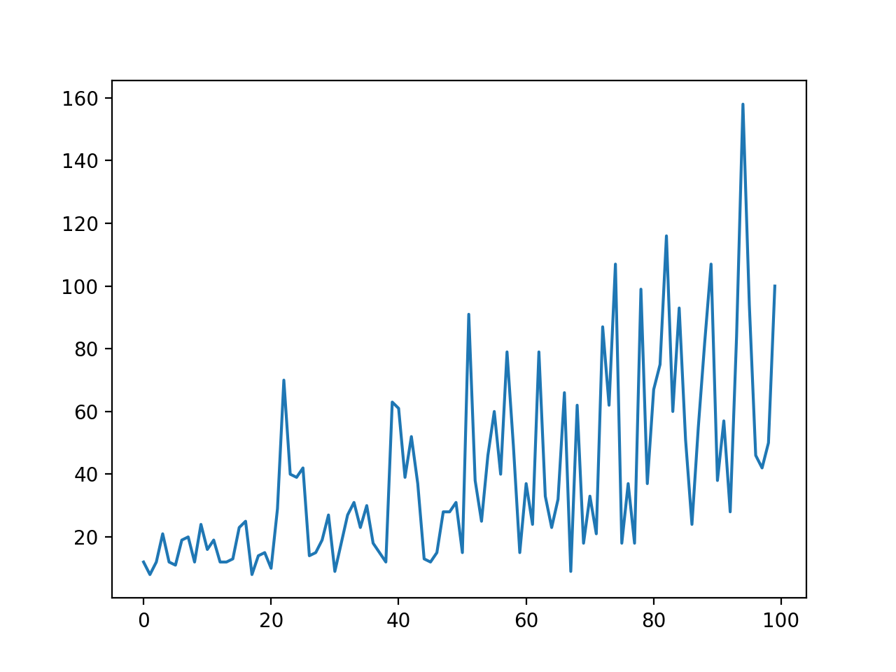

# A2C-TCP

Advance Actor Critic in Pytorch with TCP

# Results

# References

https://github.com/pytorch/tutorials/blob/master/intermediate_source/dist_tuto.rst
https://github.com/pytorch/examples/blob/master/reinforcement_learning/actor_critic.py
